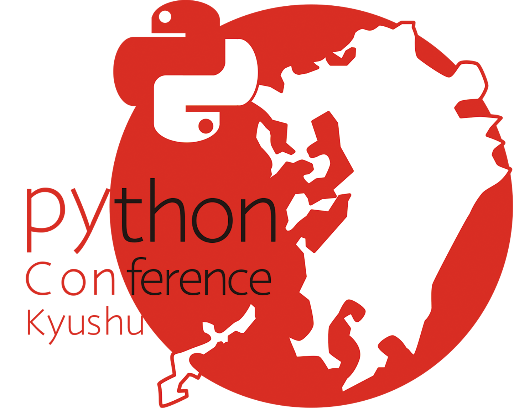

## 1. 実行委員会の概要・目的

私たちは、Pythonを九州各地に広めるべく、九州で継続的に  
Pythonのminiカンファレンス(PyConKyushu)を  
開催するために組織された非営利のボランティア団体です。  

PyConKyushuは、機械学習やディープラーニングなどで注目が高まっている  
プログラミング言語Pythonをテーマとしたカンファレンスで、  
九州各地で開催しています。  
  
私たちは、毎年開催地で座長・実行委員を募集し、現地委員を支援する形で  
イベント開催を実現してきました。   
  
現在は、Pythonカンファレンスを主体とした活動を行なっておりますが  
今後は、他の形の活動もできればと考えています。

## 2. 構成

私たちは、以下の構成で運営しています。

### 運営組織の構成について
代表　：{{committee.president}}  
副代表：{{committee.deputypresident}}  
役員　：{{committee.director1}}  

設立　：{{committee.establish}}

## 3. お問い合わせ
お問い合わせは以下までお願い致します。  
連絡先：{{committee.email}}  

[{: style="height:20%;width:20%"}](https://www.pykyushu.jp) 

!!! info
    PyCon™ is a trademark for worldwide conference activities 
    claimed by the Python Software foundation.   
    PyCon Kyushu is organized by volunteers from PyCon Kyushu in Japan.