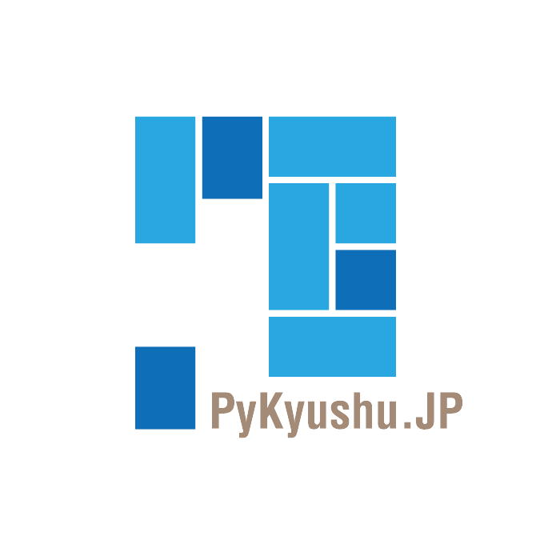

## 1. 実行委員会の概要・目的

私たちは、Pythonを九州各地に広めるべく、
九州でPythonのminiカンファレンス(PyConKyushu)を  
継続的に開催するために組織された非営利のボランティア団体です。  

PyConKyushuは、機械学習やディープラーニングなどで注目が高まっている  
プログラミング言語Pythonをテーマとしたカンファレンスで、  
九州各地で開催しています。  
  
私たちは、毎年開催地で座長・実行委員を募集し、現地委員を支援する形で  
イベント開催を実現してきました。   
  
現在は、Pythonカンファレンスを主体とした活動を行なっておりますが  
今後は、他の形の活動もできればと考えています。

## 2. 構成

私たちは、以下の構成で運営しています。

### 運営組織の構成について
代表　：濵　敬博 
副代表：清田　史和
役員　：多和田　真悟 

設立　：2017年9月21日

## 3. お問い合わせ
お問い合わせは以下までお願い致します。  
連絡先：info@pykyushu.jp

[{: style="height:20%;width:20%"}](https://www.pykyushu.jp) 
